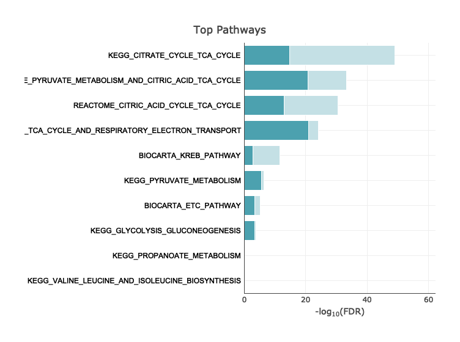

hypeR
=====

Geneset enrichment analysis based on hyper-geometric test

[](https://github.com/montilab/hypeR/commits/master) [](https://www.tidyverse.org/lifecycle/#maturing)

*For latest version, please refer to the [dev branch](https://github.com/montilab/hypeR/tree/dev)*

### Installation

``` r
library(devtools)

# Please use the dev branch until the next stable Bioconductor release
devtools::install_github("montilab/hypeR", ref="dev")
```

### Usage

``` r
# Load package
library(hypeR)

# Download msigdb genesets
# By default this saves genesets to a temporary dir (deleted after current session)
# The directory and msigdb version number is returned
msigdb_info <- download_msigdb(species="Homo sapiens") 

# One can also download the genesets to a specific directory for
# later use and to ensure reproducibility
msigdb_info <- download_msigdb(species="Homo sapiens", output_dir="path/to/dir") 
```

#### Available Genesets

``` r
db_info()
## |------------------------------------------------------------|
## | Available Gene Sets                                 v6.2.1 |
## |------------------------------------------------------------|
## | C1             | Positional (326)                          |
## | C2.CGP         | Chemical and Genetic Perturbations (3433) |
## | C2.CP          | Canonical Pathways (252)                  |
## | C2.CP.BIOCARTA | Canonical BIOCARTA (217)                  |
## | C2.CP.KEGG     | Canonical KEGG (186)                      |
## | C2.CP.REACTOME | Canonical REACTOME (674)                  |
## | C3.MIR         | Motif miRNA Targets (221)                 |
## | C3.TFT         | Motif Transcription Factor Targets (615)  |
## | C4.CGN         | Cancer Gene Neighborhoods (427)           |
## | C4.CM          | Cancer Modules (431)                      |
## | C5.BP          | GO Biological Process (4436)              |
## | C5.CC          | GO Cellular Component (580)               |
## | C5.MF          | GO Molecular Function (901)               |
## | C6             | Oncogenic Signatures (189)                |
## | C7             | Immunologic Signatures (4872)             |
## | H              | Hallmark (50)                             |
## |------------------------------------------------------------|
## | Source: http://software.broadinstitute.org/gsea/msigdb     |
## |------------------------------------------------------------|
```

```r
# Genes involed in tricarboxylic acid cycle
symbols <- c("IDH3B","DLST","PCK2","CS","PDHB","PCK1","PDHA1","LOC642502",
             "PDHA2","LOC283398","FH","SDHD","OGDH","SDHB","IDH3A","SDHC",
             "IDH2","IDH1","OGDHL","PC","SDHA","SUCLG1","SUCLA2","SUCLG2")
```

#### Loading Genesets

``` r
BIOCARTA <- db_get(msigdb_info, "C2.CP.BIOCARTA")
KEGG     <- db_get(msigdb_info, "C2.CP.KEGG")
REACTOME <- db_get(msigdb_info, "C2.CP.REACTOME")

gsets <- c(BIOCARTA, KEGG, REACTOME)
```

#### Hyper Enrichment

``` r
hyp <- hypeR(symbols, gsets, bg=7842, fdr=0.05)
## Number of genes =  24 
## Number of gene sets =  1077 
## Background population size =  7842 
## P-Value cutoff =  1 
## FDR cutoff =  0.05
```

#### Visualize Results

``` r
hyp_plot(hyp)
```



#### Interactive Table

``` r
hyp_show(hyp)
```

#### Save Results

``` r
hyp_to_excel(hyp, file.path="pathways.xlsx")
```
