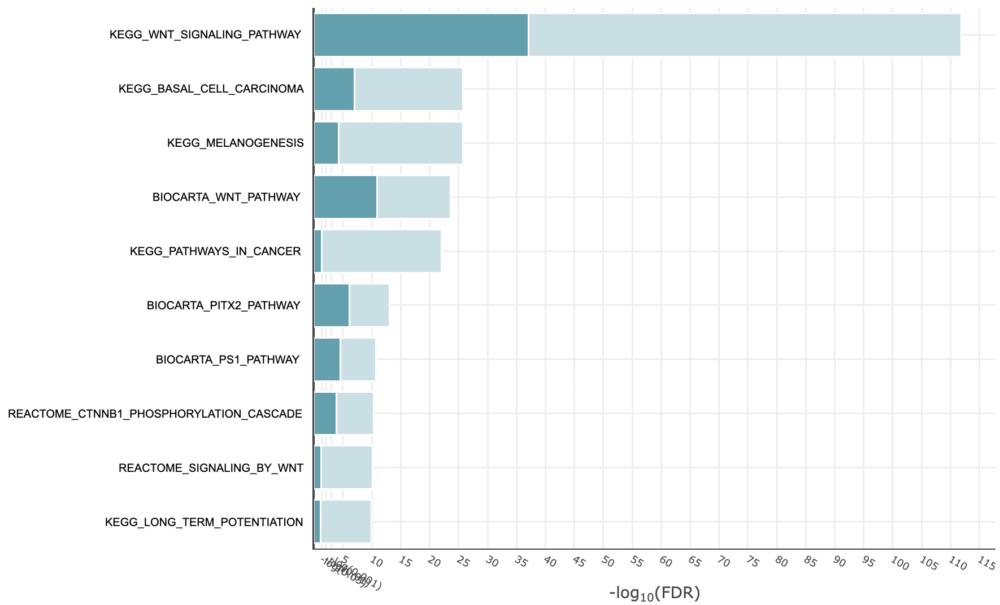
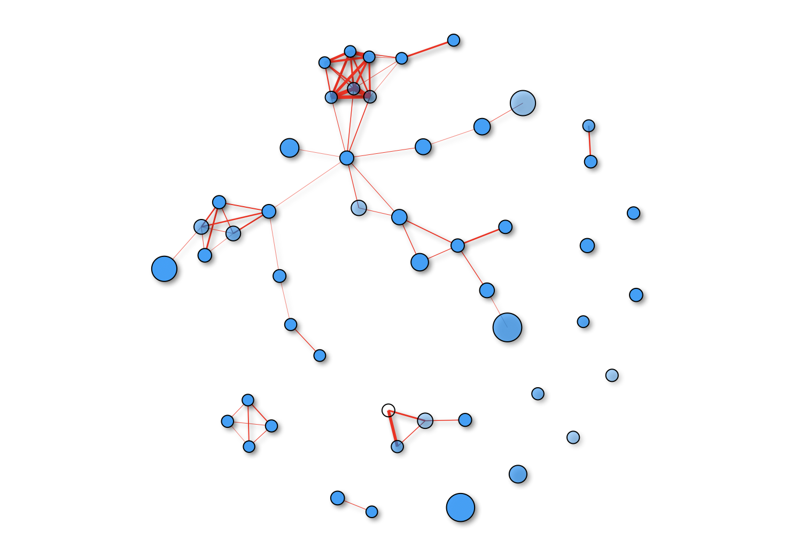

hypeR
================

Geneset enrichment analysis based on hyper-geometric
test

[](https://github.com/montilab/hypeR/commits/master)
[](https://www.tidyverse.org/lifecycle/#maturing)

<!-- README.md is generated from README.Rmd. Please edit that file -->

1.  [Installation](#installation)
2.  [Downloading Genesets](#downloading-genesets)
    1.  [Using msigdb](#using-msigdb)
    2.  [Using hyperdb](#using-hyperdb)
3.  [hypeR Enrichment](#hyper-enrichment)
    1.  [Single Signature](#single-signature)
        1.  [Plot results](#plot-results)
        2.  [Enrichment map](#enrichment-map)
        3.  [Show data](#show-data)
    2.  [Multiple Signatures](#multiple-signatures)
        1.  [Export to excel](#export-to-excel)
        2.  [Export to table](#export-to-table)
    3.  [Multiple Experiments](#multiple-experiments)  
        a. [Markdown report](#markdown-report)

## Installation

While hypeR is currently a [Bioconductor
package](https://www.bioconductor.org/packages/devel/bioc//html/hypeR.html),
please use the dev branch to take advantage of the most updated
features, until the next stable Bioconductor release.

``` r
library(devtools)

devtools::install_github("montilab/hypeR", ref="dev")
```

``` r
library(hypeR)
```

## Downloading Genesets

### Using msigdb

For most user purposes, the genesets hosted by
[msigdb](https://software.broadinstitute.org/gsea/msigdb/collections.jsp)
are more than adequate to perform geneset enrichment analysis.
Therefore, we have added convenient functions for retrieving msigdb data
compatible with hypeR.

#### Available msigdb genesets

``` r
hypeR::msigdb_info()
```

    ## |------------------------------------------------------------|
    ## | Available Gene Sets                                 v6.2.1 |
    ## |------------------------------------------------------------|
    ## | C1             | Positional (326)                          |
    ## | C2.CGP         | Chemical and Genetic Perturbations (3433) |
    ## | C2.CP          | Canonical Pathways (252)                  |
    ## | C2.CP.BIOCARTA | Canonical BIOCARTA (217)                  |
    ## | C2.CP.KEGG     | Canonical KEGG (186)                      |
    ## | C2.CP.REACTOME | Canonical REACTOME (674)                  |
    ## | C3.MIR         | Motif miRNA Targets (221)                 |
    ## | C3.TFT         | Motif Transcription Factor Targets (615)  |
    ## | C4.CGN         | Cancer Gene Neighborhoods (427)           |
    ## | C4.CM          | Cancer Modules (431)                      |
    ## | C5.BP          | GO Biological Process (4436)              |
    ## | C5.CC          | GO Cellular Component (580)               |
    ## | C5.MF          | GO Molecular Function (901)               |
    ## | C6             | Oncogenic Signatures (189)                |
    ## | C7             | Immunologic Signatures (4872)             |
    ## | H              | Hallmark (50)                             |
    ## |------------------------------------------------------------|
    ## | Source: http://software.broadinstitute.org/gsea/msigdb     |
    ## |------------------------------------------------------------|

#### Downloading and loading msigdb genesets

Use hypeR::msigdb\_get() to retrieve a downloaded geneset. In this
example, we are interested in all three of the following genesets,
therefore we concatenate them. A geneset is simply a named list of
character vectors, therefore, one can use any custom geneset in their
analysis, as long as it is appropriately defined.

``` r
msigdb_path <- hypeR::msigdb_download(species="Homo sapiens")
```

    ## v6.2.1
    ## Downloading Gene Sets to...
    ## /var/folders/7j/bg701dss38lc2xq26vt_by240000gn/T//Rtmpmk1Vgr
    ## - C1 -> 326 Gene Sets 
    ## - C2.CGP -> 3433 Gene Sets 
    ## - C2.CP -> 252 Gene Sets 
    ## - C2.CP.BIOCARTA -> 217 Gene Sets 
    ## - C2.CP.KEGG -> 186 Gene Sets 
    ## - C2.CP.REACTOME -> 674 Gene Sets 
    ## - C3.MIR -> 221 Gene Sets 
    ## - C3.TFT -> 615 Gene Sets 
    ## - C4.CGN -> 427 Gene Sets 
    ## - C4.CM -> 431 Gene Sets 
    ## - C5.BP -> 4436 Gene Sets 
    ## - C5.CC -> 580 Gene Sets 
    ## - C5.MF -> 901 Gene Sets 
    ## - C6 -> 189 Gene Sets 
    ## - C7 -> 4872 Gene Sets 
    ## - H -> 50 Gene Sets

``` r
BIOCARTA <- msigdb_get(msigdb_path, "C2.CP.BIOCARTA")
KEGG     <- msigdb_get(msigdb_path, "C2.CP.KEGG")
REACTOME <- msigdb_get(msigdb_path, "C2.CP.REACTOME")

gsets <- c(BIOCARTA, KEGG, REACTOME)
```

``` r
# Geneset labels
names(gsets)[1:5]
```

    ## [1] "BIOCARTA_41BB_PATHWAY"   "BIOCARTA_ACE2_PATHWAY"  
    ## [3] "BIOCARTA_ACH_PATHWAY"    "BIOCARTA_ACTINY_PATHWAY"
    ## [5] "BIOCARTA_AGPCR_PATHWAY"

``` r
# Gene symbols
gsets$BIOCARTA_41BB_PATHWAY[1:5]
```

    ## [1] "ATF2"  "CHUK"  "IFNG"  "IKBKB" "IL2"

### Using hyperdb

As mentioned previously, one can use custom genesets with hypeR. If
msigdb genesets are not sufficient, we have also provided another set of
functions for downloading and loading other open source genesets. This
is facilitated by interfacing with the publicly available
[libraries](https://amp.pharm.mssm.edu/Enrichr/#stats) hosted by
[Enrichr](https://amp.pharm.mssm.edu/Enrichr/).

#### Available genesets

``` r
hypeR::hyperdb_info()
```

#### Downloading and loading hyperdb genesets

``` r
gsets <- hypeR::hyperdb_get("Cancer_Cell_Line_Encyclopedia")
```

### hypeR enrichment

#### Single signature

Often we are just interested in a single signature. Here we define our
signature or genes of interest as a portion of the Wnt signaling pathway
(to ensure we get some significant results). In this case, hypeR will
return a *hyp object*. This object contains relevant information to the
enrichment results and is recognized by downstream visualization and
analysis tools.

``` r
signature <- gsets$KEGG_WNT_SIGNALING_PATHWAY[1:50]

hyp <- hypeR::hypeR(signature, gsets, bg=2520)
```

``` r
# A hyp object
class(hyp)
```

    ## [1] "hyp"
    ## attr(,"package")
    ## [1] "hypeR"

``` r
# Convert to a dataframe
hyp.df <- as(hyp, "data.frame")
hyp.df[1:5,1:2]
```

    ##                               pval     fdr
    ## KEGG_WNT_SIGNALING_PATHWAY 1.3e-65 1.4e-62
    ## BIOCARTA_WNT_PATHWAY       7.2e-15 3.9e-12
    ## KEGG_BASAL_CELL_CARCINOMA  2.0e-14 7.3e-12
    ## KEGG_MELANOGENESIS         1.8e-12 4.9e-10
    ## BIOCARTA_PITX2_PATHWAY     4.5e-09 9.7e-07

#### Plot results

``` r
hypeR::hyp_plot(hyp)
```



#### Enrichment map

``` r
hypeR::hyp_emap(hyp)
```



#### Show data

``` r
hypeR::hyp_show(hyp)
```


#### Multiple signatures

Other times we are looking at multiple signatures that may have been
defined in a single experiment. In this case, we can feed hypeR a named
list of signatures and a *multihyp object* will be returned. This object
is essentially just multiple *hyp objects*. However it is recognized and
handled differently by downstream visualization and analysis tools.

``` r
set.seed(1)
experiment <- list("YAP-KO Signature"=sample(gsets[[sample(names(gsets), 1)]], 10),
                   "YAP-KO Up-regulated"=sample(gsets[[sample(names(gsets), 1)]], 10),
                   "YAP-KO Down-regulated"=sample(gsets[[sample(names(gsets), 1)]], 10))

multihyp <- hypeR(experiment, gsets, bg=2520)
```

#### Plot results

When plotting a multihyp object, each signatures is plotted and returned
separately.

``` r
hypeR::hyp_plot(multihyp)
```

#### Export to excel

When saving a multihyp object to excel, each signature is exported to
its own tab.

``` r
hypeR::hyp_to_excel(multihyp, file.path="hyper.xls")
```

#### Export to table

When saving a multihyp object to a table, each signature is exported as
its own table in a single directory.

``` r
hypeR::hyp_to_table(multihyp, file.path="hyper.txt")
```

#### Multiple experiments

Sometimes, we are generating enrichment reports for mutliple signatures
across multiple experiments. Typically, the best way to manage this data
is to process it all at once and generate a markdown report to analyze
ourselves or share with our collaborators.

``` r
set.seed(1)
experiment.1 <- list("YAP-KO Signature"=sample(gsets[[sample(names(gsets), 1)]], 10),
                     "YAP-KO Up-regulated"=sample(gsets[[sample(names(gsets), 1)]], 10),
                     "YAP-KO Down-regulated"=sample(gsets[[sample(names(gsets), 1)]], 10))
set.seed(2)
experiment.2 <- list("LATS-KO Signature"=sample(gsets[[sample(names(gsets), 1)]], 10),
                     "LATS-KO Up-regulated"=sample(gsets[[sample(names(gsets), 1)]], 10),
                     "LATS-KO Down-regulated"=sample(gsets[[sample(names(gsets), 1)]], 10))
set.seed(3)
experiment.3 <- list("TEAD-KO Signature"=sample(gsets[[sample(names(gsets), 1)]], 10),
                     "TEAD-KO Up-regulated"=sample(gsets[[sample(names(gsets), 1)]], 10),
                     "TEAD-KO Down-regulated"=sample(gsets[[sample(names(gsets), 1)]], 10))

experiments <- list("YAP-KO Experiment"=experiment.1,
                    "LATS-KO Experiment"=experiment.2,
                    "TEAD-KO Experiment"=experiment.3)

lmultihyp <- lapply(experiments, function(x) hypeR(x, gsets, bg=2520))
```

#### Markdown report

``` r
hypeR::hyp_to_rmd(lmultihyp,
                  file_path="hyper-enrichment.rmd",
                  title="Hyper Enrichment (hypeR)",
                  subtitle="YAP, LATS, and TEAD Knockout Experiments",
                  author="Anthony Federico, Stefano Monti",
                  show_plots=T,
                  show_emaps=F,
                  show_tables=T)
```


