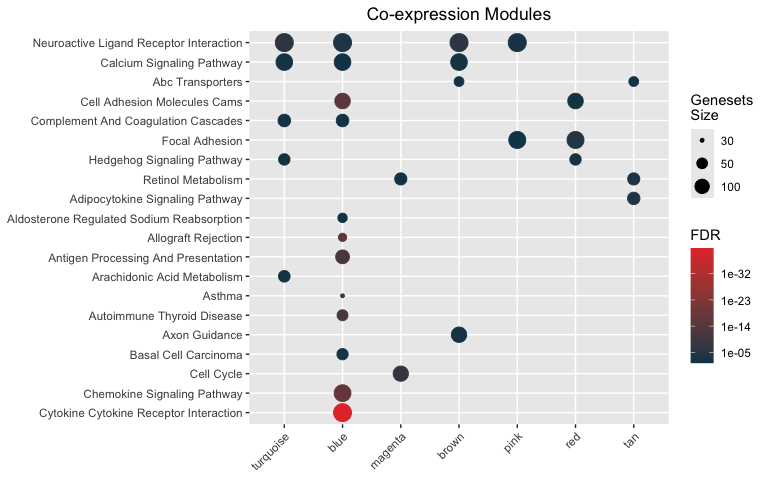

<!-- README.md is generated from README.Rmd. Please edit that file -->

# hypeR


[](https://doi.org/doi:10.18129/B9.bioc.hypeR)
[](https://bioconductor.org/checkResults/3.9/bioc-LATEST/hypeR/)
[](https://www.tidyverse.org/lifecycle/#stable)
[](https://github.com/montilab/hypeR/commits/master)

## Documentation

Please visit <https://montilab.github.io/hypeR-docs/>

You can also try out our
[web-application](https://hyper-shiny.shinyapps.io/wapp/) if you prefer
an interface\!

## Requirements

We recommend the latest version of R (\>= 4.0.0) but **hypeR** currently
requires R (\>= 3.6.0) to be installed directly from Github or
Bioconductor. To install with R (\>= 3.5.0) see below. Use with R (\<
3.5.0) is not recommended.

## Installation

Install the development version of the package from Github.
<span style="color:#0278ae">**\[Recommended\]**</span>

``` r
devtools::install_github("montilab/hypeR")
```

Or install the development version of the package from Bioconductor.

``` r
BiocManager::install("montilab/hypeR", version="devel")
```

Or install with Conda.

``` bash
conda create --name hyper
source activate hyper
conda install -c r r-devtools
R
library(devtools)
devtools::install_github("montilab/hypeR")
```

Or install with previous versions of R.

``` bash
git clone https://github.com/montilab/hypeR
nano hypeR/DESCRIPTION
# Change Line 8
# Depends: R (>= 3.6.0) -> Depends: R (>= 3.5.0)
R
install.packages("path/to/hypeR", repos=NULL, type="source")
```

## Usage

``` r
library(hypeR)
```

``` r
data(wgcna)

# Process many signatures
signatures <- wgcna[[1]]
str(signatures)
```

    #> List of 21
    #>  $ turquoise   : chr [1:1902] "CLEC3A" "KCNJ3" "SCGB2A2" "SERPINA6" ...
    #>  $ blue        : chr [1:1525] "GSTM1" "BMPR1B" "BMPR1B-DT" "PYDC1" ...
    #>  $ magenta     : chr [1:319] "DSCAM-AS1" "VSTM2A" "UGT2B11" "CYP4Z1" ...
    #>  $ brown       : chr [1:1944] "SLC25A24P1" "CPB1" "GRIA2" "CST9" ...
    #>  $ pink        : chr [1:578] "MUC6" "GLRA3" "OPRPN" "ARHGAP36" ...
    #>  $ red         : chr [1:681] "KCNC2" "SLC5A8" "HNRNPA1P57" "CBLN2" ...
    #>  $ darkred     : chr [1:43] "OR4K12P" "GRAMD4P7" "FAR2P3" "CXADRP3" ...
    #>  $ tan         : chr [1:161] "LEP" "SIK1" "TRARG1" "CIDEC" ...
    #>  $ lightcyan   : chr [1:82] "CDC20B" "FOXJ1" "CDHR4" "MCIDAS" ...
    #>  $ purple      : chr [1:308] "C10orf82" "GUSBP3" "IGLV10-54" "IGKV1D-13" ...
    #>  $ lightyellow : chr [1:48] "SLC6A4" "ERICH3" "GP2" "TRIM72" ...
    #>  $ cyan        : chr [1:143] "NOP56P1" "FABP6" "GNAQP1" "ZNF725P" ...
    #>  $ royalblue   : chr [1:47] "PCDHA12" "PCDHA11" "PCDHA4" "PCDHA1" ...
    #>  $ black       : chr [1:864] "NSFP1" "USP32P2" "OCLNP1" "RN7SL314P" ...
    #>  $ yellow      : chr [1:904] "NPIPB15" "MAFA-AS1" "C1orf167" "NT5CP2" ...
    #>  $ lightgreen  : chr [1:60] "HIST1H2APS3" "HIST1H2AI" "HIST1H1PS1" "HIST1H3H" ...
    #>  $ darkgrey    : chr [1:34] "MTND4P12" "MTRNR2L1" "MT-TT" "MTCYBP18" ...
    #>  $ darkgreen   : chr [1:43] "STK19B" "SNCG" "ELANE" "TNXA" ...
    #>  $ midnightblue: chr [1:92] "LRRC26" "ARHGDIG" "TGFBR3L" "HS6ST1P1" ...
    #>  $ grey60      : chr [1:71] "KRT8P48" "KRT8P42" "KRT8P11" "CRIP1P4" ...
    #>  $ salmon      : chr [1:151] "UBA52P3" "NPM1P33" "MYL6P5" "RPL29P30" ...

``` r
# Access to hundreds of genesets
genesets <- msigdb_gsets("Homo sapiens", "C2", "CP:KEGG", clean=TRUE)
print(genesets)
```

    #> C2.CP:KEGG v7.4.1 
    #> Abc Transporters (44)
    #> Acute Myeloid Leukemia (57)
    #> Adherens Junction (73)
    #> Adipocytokine Signaling Pathway (67)
    #> Alanine Aspartate And Glutamate Metabolism (32)
    #> Aldosterone Regulated Sodium Reabsorption (42)

``` r
mhyp <- hypeR(signatures, genesets, test="hypergeometric", background=30000)
```

``` r
hyp_dots(mhyp, merge=TRUE, fdr=0.05, title="Co-expression Modules")
```



## Terminology

### Signature

**hypeR** employs multiple types of enrichment analyses
(e.g. hypergeometric, kstest, gsea). Depending on the type, different
kinds of signatures are expected. There are three types of signatures
`hypeR()` expects.

``` r
# Simply a character vector of symbols (hypergeometric)
signature <- c("GENE1", "GENE2", "GENE3")

# A ranked character vector of symbols (kstest)
ranked.signature <- c("GENE2", "GENE1", "GENE3")

# A ranked named numerical vector of symbols with ranking weights (gsea)
weighted.signature <- c("GENE2"=1.22, "GENE1"=0.94, "GENE3"=0.77)
```

### Geneset

A geneset is simply a list of vectors, therefore, one can use any custom
geneset in their analyses, as long as it’s appropriately defined.

``` r
genesets <- list("GSET1" = c("GENE1", "GENE2", "GENE3"),
                 "GSET2" = c("GENE4", "GENE5", "GENE6"),
                 "GSET3" = c("GENE7", "GENE8", "GENE9"))
```

#### Hyper enrichment

All workflows begin with performing hyper enrichment with `hyper()`.
Often we are just interested in a single signature, as described above.
In this case, `hyper()` will return a `hyp` object. This object contains
relevant information to the enrichment results and is recognized by
downstream methods.

``` r
hyp_obj <- hypeR(signature, genesets)
```

#### Downstream methods

Please visit the [documentation](https://montilab.github.io/hypeR-docs/)
for detailed functionality. Below is a brief list of some methods.

##### Downloading genesets

``` r
BIOCARTA <- msigdb_gsets(species="Homo sapiens", category="C2", subcategory="CP:BIOCARTA")
KEGG     <- msigdb_gsets(species="Homo sapiens", category="C2", subcategory="CP:KEGG")
REACTOME <- msigdb_gsets(species="Homo sapiens", category="C2", subcategory="CP:REACTOME")
```

##### Visualize results

``` r
# Show interactive table
hyp_show(hyp_obj)

# Plot dots plot
hyp_dots(hyp_obj)

# Plot enrichment map
hyp_emap(hyp_obj)

# Plot hiearchy map (relational genesets)
hyp_hmap(hyp_obj)
```

##### Saving results

``` r
# Map enrichment to an igraph object (relational genesets)
hyp_to_graph(hyp_obj)

# Save to excel
hyp_to_excel(hyp_obj, file_path="hypeR.xlsx")

# Save to table
hyp_to_table(hyp_obj, file_path="hypeR.txt")

# Generate markdown report
hyp_to_rmd(hyp_obj,
           file_path="hypeR.rmd",
           title="Hyper Enrichment (hypeR)",
           subtitle="YAP, TNF, and TAZ Knockout Experiments",
           author="Anthony Federico, Stefano Monti")
```

## Related Repositories

  - [hypeR-db](https://github.com/montilab/hypeR-db) *A repository for
    commonly used open source genesets used by hypeR*
  - [hypeR-shiny](https://github.com/montilab/hypeR-shiny) *Our Shiny
    web application built on hypeR*
  - [hypeR-modules](https://github.com/montilab/hypeR-modules)
    *Integration of hypeR modules in custom Shiny applications*
  - [hypeR-docs](https://github.com/montilab/hypeR-docs) *Landing site
    for hosting documentation for hypeR*
  - [hypeR-workshop](https://github.com/montilab/hypeR-workshop)
    *Materials for a hypeR tutorial workshop*

## Cite

``` r
citation("hypeR")
```

    #> 
    #> To cite hypeR in publications use:
    #> 
    #>   Federico, A. & Monti, S. hypeR: an R package for geneset enrichment
    #>   workflows. Bioinformatics 36, 1307–1308 (2020).
    #> 
    #> A BibTeX entry for LaTeX users is
    #> 
    #>   @Article{,
    #>     title = {hypeR: an R package for geneset enrichment workflows},
    #>     author = {Anthony Federico and Stefano Monti},
    #>     journal = {Bioinformatics},
    #>     year = {2020},
    #>     volume = {36},
    #>     number = {4},
    #>     pages = {1307-1308},
    #>     url = {https://doi.org/10.1093/bioinformatics/btz700},
    #>   }
